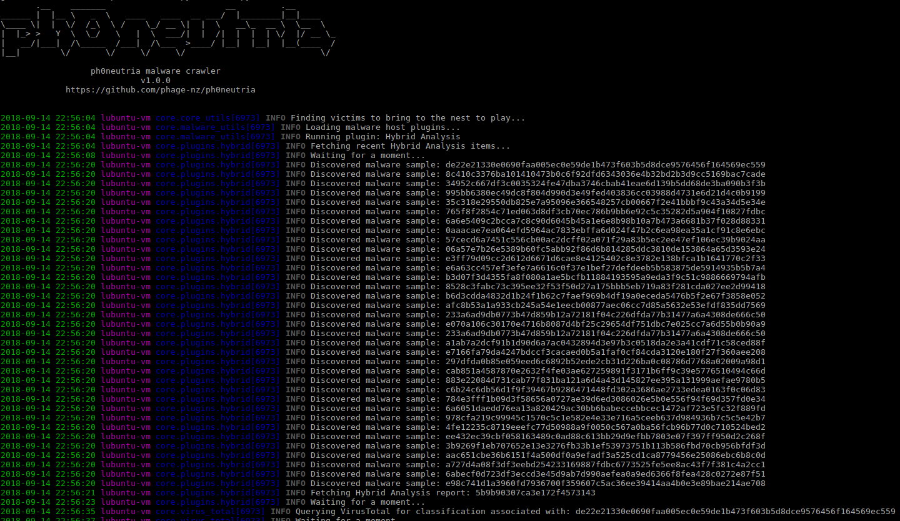
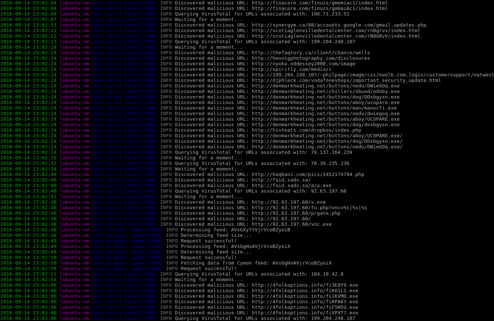
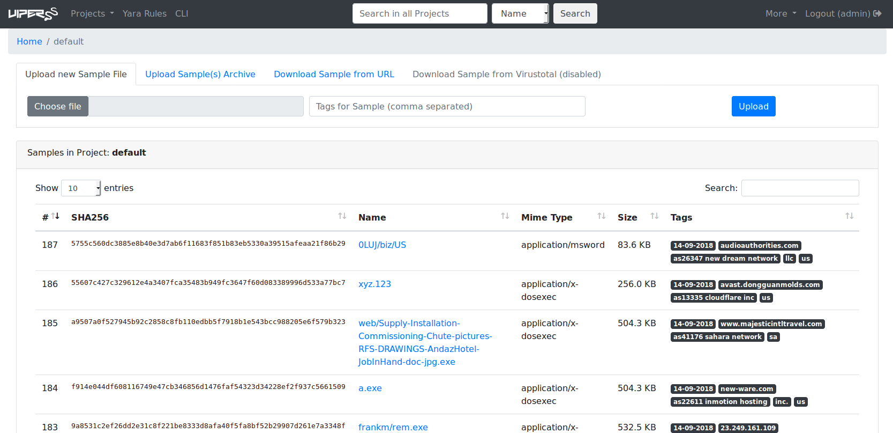

# ph0neutria #
**ph0neutria malware crawler  
v0.9.1  
https://github.com/phage-nz/ph0neutria**

### About ###
ph0neutria is a malware zoo builder that sources samples straight from the wild. Everything is stored in Viper for ease of access and manageability.  

This project was inspired by Ragpicker (https://github.com/robbyFux/Ragpicker, formerly known as "Malware Crawler"). However, ph0neutria aims to:
- Limit the scope of crawling to only frequently updated and reliable sources.
- Maximise the effectiveness of individual indicators.
- Offer a single, reliable and well organised storage mechanism.
- Not do work that can instead be done by Viper.

What does the name mean? "Phoneutria nigriventer" is commonly known as the Brazillian Wandering Spider: https://en.wikipedia.org/wiki/Brazilian_wandering_spider

### Sources ###
URL feeds:
- Malc0de.  
- Malshare.  
- VX Vault.  

OSINT. If required, passive DNS is used to produce a list of recent IP's for a domain, and VirusTotal queried for recent URL's pertaining to the IP. Only one source may be queried at any one time so not to exceed VirusTotal API request limits. The resulting URL lists from each source are filtered by levenshtein distance to reduce the number of similar items, and are processed in their own thread.
- AlienVault OTX.
- CyberCrime Tracker.
- DNS-BH.
- Payload Security (Hybrid Analysis).
- Shodan.
- ThreatExpert.

### Screenshots ###

### Version Notes ###
- **0.6.0:** Tor proxying requires pysocks (pip install pysocks) and at least version 2.10.0 of python requests for SOCKS proxy support.  
- **0.9.0:** OSINT functionality pulled from Phage Malware Tracker (private project) - requires VirusTotal API key. More robust retrieval of wild files. Local URL and hash caching (reduces API load).  
- **0.9.1:** Updated to use V3 Viper API. No longer compatiable with V2.

### Installation ###
The following script will install ph0neutria along with Viper and Tor:  

*wget https://raw.githubusercontent.com/phage-nz/ph0neutria/master/install.sh  
chmod +x install.sh  
sudo ./install.sh*  

Simple as that!

#### Optional: ####
Configure additional ClamAV signatures:  

*cd /tmp  
git clone https://github.com/extremeshok/clamav-unofficial-sigs  
cd clamav-unofficial-sigs  
cp clamav-unofficial-sigs.sh /usr/local/bin  
chmod 755 /usr/local/bin/clamav-unofficial-sigs.sh  
mkdir /etc/clamav-unofficial-sigs  
cp config/* /etc/clamav-unofficial-sigs  
cd /etc/clamav-unofficial-sigs*  

Rename os.\<yourdistro\>.conf to os.conf, for example:  
*mv os.ubuntu.conf os.conf*  

Modify configuration files:  
- **master.conf:** search for "Enabled Databases" and enable/disable desired sources.  
- **user.conf:** uncomment the required lines for sources you have enabled and complete them. user.conf overrides master.conf. You must uncomment user_configuration_complete="yes" once you've completed setup for the following commands to succeed.  

For more configuration info see: https://github.com/extremeshok/clamav-unofficial-sigs  

*mkdir /var/log/clamav-unofficial-sigs  
clamav-unofficial-sigs.sh --install-cron  
clamav-unofficial-sigs.sh --install-logrotate  
clamav-unofficial-sigs.sh --install-man  
clamav-unofficial-sigs.sh  
cd /tmp/clamav-unofficial-sigs  
cp systemd/\* /etc/systemd  
cd ..  
rm -rf clamav-unofficial-sigs*  

It'll take a while to pull down the new signatures - during which time ClamAV may not be available.

### Usage ###
Take precautions when piecing together your malware zoo:  
- Do not disable Tor unless replacing with an anonymous VPN.
- Operate on an isolated network and on dedicated hardware.
- Only execute samples in a suitable Sandbox (refer: https://github.com/phage-nz/malware-hunting/tree/master/sandbox).
- Monitor for abuse of your API keys.

Ensure Tor is started:  

*service tor restart*  

Start the Viper API and web interface:  

*cd /opt/viper  
sudo -H -u spider python viper-web*  

Take note of the admin password that is created when Viper is started. Use this to log into http://\<viper IP\>:\<viper port\>/admin (default: http://127.0.0.1:8080/admin) and retrieve the API token from the Tokens page.  

The main Viper web interface will be available at http://\<viper IP\>:\<viper port\> (default: http://127.0.0.1:8080).  

- Complete the config file at: /opt/ph0neutria/config/settings.conf  

Start ph0neutria:  

*cd /opt/ph0neutria  
sudo -H -u spider python run.py*

You can press Ctrl+C at any time to kill the run. You are free to run it again as soon as you'd like - you can't end up with database duplicates.

To run this daily, create a script in /etc/cron.daily with the following:  

*#!/bin/bash  
cd /opt/ph0neutria && sudo -H -u spider python run.py*

### Tags and Notes ###
Tags:  
**{1},{2},{3}**  

- Date stamp.
- Source domain (see Known Issues).
- 'ph0neutria' identifier (tag).

Notes:  
**{1)({2})**

- 'ph0neutria' identifier (title).
- Source URL.  

The original name of the file forms the identifying name within Viper.

### Known Issues ###
- Viper tags are forced to lowercase (by Viper). If you do not want this behavior then I'd recommend removing all occurrences of .lower() in viper/viper/core/database.py

### References ###
- http://malshare.com/doc.php - MalShare API documentation.
- http://viper-framework.readthedocs.io/en/latest/usage/web.html - Viper API documentation.
- https://developers.virustotal.com/v2.0/reference - VirusTotal API documentation.
- https://www.hybrid-analysis.com/apikeys/info - Payload Security API documentation.
- https://otx.alienvault.com/api - AlienVault OTX API documentation.
